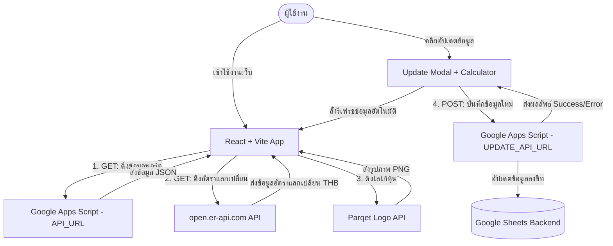

# บริบทของผลิตภัณฑ์ (Product Context)

ระบบบันทึกและติดตามการลงทุนในหุ้นสหรัฐฯ (Stock US Investment Tracker) ออกแบบมาเพื่อเป็นแดชบอร์ดส่วนตัวที่ช่วยจัดการ ตรวจสอบ และอัปเดตข้อมูลพอร์ตการลงทุนอย่างมีประสิทธิภาพและสวยงาม

---

## 1. ปัญหาหลักที่ผลิตภัณฑ์นี้แก้ไข (The Problems It Solves)
- **การติดตามพอร์ตแบบกระจายตัว**: นักลงทุนทั่วไปมักจะจดบันทึกการซื้อขายและปันผลแยกย่อยหลายที่ (เช่น Excel, สมุดบันทึก, แอปพลิเคชันเทรด) ผลิตภัณฑ์นี้รวบรวมทุกข้อมูลมาไว้ที่เดียวกัน
- **ความซับซ้อนในการคำนวณเป้าหมาย**: การคำนวณเป้าหมายการสะสมหุ้นแต่ละตัว (ตามจำนวนเดือนที่ผ่านไปและราคาตั้งซื้อ) มักทำได้ยาก ผลิตภัณฑ์นี้ช่วยคำนวณยอดสะสมเป้าหมาย (Target Accumulation) และยอดคงเหลือที่ต้องซื้อเพิ่มโดยอัตโนมัติ
- **การแปลงสกุลเงินเชิงเปรียบเทียบ**: สำหรับหุ้นต่างประเทศ การเปรียบเทียบมูลค่าระหว่าง USD และ THB ในทันทีมีความสำคัญ ระบบนี้ช่วยดึงอัตราแลกเปลี่ยนปัจจุบันแบบเรียลไทม์และแปลงค่าเงินทุกรายการให้เห็นคู่กันเสมอ
- **การคำนวณตัวเลขและกรอกข้อมูล**: การบันทึกรายการซื้อขายบางครั้งต้องคำนวณหลายธุรกรรมย่อย การใส่เครื่องคิดเลขลงในฟิลด์กรอกข้อมูลโดยตรงช่วยประหยัดเวลาและลดความผิดพลาด

---

## 2. ประสบการณ์ของผู้ใช้ (User Experience & Workflow)
1. **หน้าแรก (Dashboard View)**:
   - แสดงอัตราแลกเปลี่ยน USD/THB ปัจจุบัน
   - แถบเปลี่ยนพอร์ตหลักตามประเภท (Hold, Trade, Sale)
   - แดชบอร์ดสรุปผลเชิงตัวเลข (จำนวนหุ้น, ปันผลเฉลี่ย, ยอดตั้งซื้อทั้งหมด, ยอดซื้อรวม, ยอดขายรวม, ยอดกำไรรวม, ปันผลรวม, ภาษีรวม, และรายได้สุทธิ)
2. **การควบคุมรายการ (Controls)**:
   - ค้นหาข้อมูลได้แบบ Real-time (ค้นหาด้วย Ticker, ชื่อบริษัท, ตลาด หรือสถานะ)
   - ตัวกรองพอร์ตย่อย (Sub-Port Tabs) พร้อมแสดงจำนวนหุ้นในพอร์ตนั้นๆ
   - การเรียงลำดับอเนกประสงค์ (Sorting) เช่น เรียงตามกำไร, รายได้, ราคาหุ้น, อัตราปันผล, ยอดปันผล, อายุการถือครอง, ซื้อล่าสุด และขายล่าสุด
3. **การ์ดข้อมูลหุ้นแบบละเอียด (Stock Cards)**:
   - ดึงโลโก้ของแบรนด์โดยอัตโนมัติ (Parqet API)
   - ลิงก์เชื่อมโยงไปยังกราฟเทคนิคบน TradingView
   - แท็กสีแสดงสถานะการถือครอง (ถืออยู่, ขายบางส่วน, ขายแล้ว)
   - แสดงเวลาสัมพัทธ์ (Relative Time) เช่น "วันนี้", "เมื่อครู่", "3 วันที่แล้ว" พร้อมระบบ Popover แสดงวันที่จริงเมื่อคลิก
   - ปุ่ม **"อัปเดต"** เพื่อเปิดหน้าต่างอัปเดตตัวเลข
4. **หน้าต่างอัปเดตข้อมูล (Update Modal)**:
   - บันทึกวันที่ซื้อ/ขายล่าสุด
   - บันทึกยอดรวมการซื้อ, การขาย, ปันผล และภาษี
   - **ฟีเจอร์เด่น**: เครื่องคิดเลขในตัว (Popover Calculator) สำหรับคิดคำนวณตัวเลขย่อยๆ ก่อนกดยอมรับค่าลงในฟิลด์อินพุต
   - บันทึกข้อมูลกลับไปที่ Google Sheets (ผ่าน Google Apps Script API) ทันทีพร้อมกล่องความสำเร็จ (Success Modal) และทำการโหลดข้อมูลใหม่โดยอัตโนมัติ

---

## 3. สถาปัตยกรรมข้อมูลและการทำงาน (How It Works)

---

## 4. กลุ่มเป้าหมายหลัก
- นักลงทุนส่วนบุคคลที่ต้องการความรวดเร็วในการติดตามพอร์ตหุ้นสหรัฐฯ ของตนเอง
- ผู้ที่ต้องการระบบบันทึกปันผลและการซื้อขายที่ปลอดภัยและยืดหยุ่นผ่านระบบคลาวด์ของ Google Sheets ของตัวเอง
- ผู้ที่ต้องการความยืดหยุ่นในเรื่องอินเทอร์เฟซที่ทันสมัย รวดเร็วแบบ Single Page Application (SPA)
