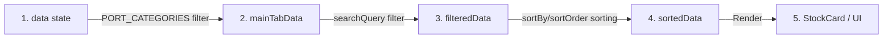

# รูปแบบระบบและสถาปัตยกรรม (System Patterns)

หน้านี้อธิบายเกี่ยวกับการออกแบบสถาปัตยกรรม เทคโนโลยีที่เลือกใช้ โครงสร้างโค้ด และลวดลายการออกแบบ (Design Patterns) ของโปรเจค **Invest**

---

## 1. เทคโนโลยีหลัก (Tech Stack)
- **Frontend Framework**: [React 19.2.6](https://react.dev/) (ใช้ความสามารถของ useMemo, useState, useEffect, useRef)
- **Build Tool & Dev Server**: [Vite 8.0.12](https://vite.dev/) (เพื่อความรวดเร็วในการพัฒนา Hot Module Replacement - HMR)
- **Styling & Theme**: Vanilla CSS ล้วนๆ (ผ่าน `src/index.css`)
- **Animation**: [Framer Motion 12.38.0](https://www.framer.com/motion/) (จัดการการเคลื่อนไหวที่นุ่มนวลในการสลับแท็บ การเปิด Modal และการขยับการ์ดหุ้นแบบ Layout-aware)
- **Icons**: FontAwesome 6.4.0 (โหลดผ่าน CDN ใน `index.html`) และ Lucide React
- **Data Backend**: Google Sheets เชื่อมโยงผ่าน Google Apps Script (REST Web App)
- **Exchange Rate Provider**: Open ER-API (`https://open.er-api.com/v6/latest/USD`)

---

## 2. โครงสร้างโฟลเดอร์ของโปรเจค (Directory Structure)

```text
invest/
├── .git/                 # เก็บประวัติการเปลี่ยนแปลงโค้ด
├── dist/                 # ไฟล์ที่ผ่านการ Build พร้อม Deploy (บน GitHub Pages)
├── public/               # Static assets เช่น favicon, รูปภาพ
├── memory-bank/          # [NEW] เอกสารทำความเข้าใจและบันทึกความจำของโปรเจค
├── src/
│   ├── assets/           # รูปภาพหรือไฟล์ Asset ภายในแอพ
│   ├── App.jsx           # ไฟล์หลักที่รวม Logic และ UI Components ของหน้าจอ
│   ├── index.css         # ไฟล์ CSS สไตล์หลักที่ระบุ Design System ทั้งหมด
│   └── main.jsx          # จุดเริ่มต้นการเรนเดอร์ React App เข้ากับ HTML root
├── index.html            # โครงร่าง HTML และการตั้งค่า Font/CDN
├── vite.config.js        # กำหนดคอนฟิกของ Vite (React Plugin)
├── package.json          # ไฟล์จัดการ Dependencies และ NPM Scripts
└── README.md             # คู่มือโปรเจคเริ่มต้น
```

---

## 3. รูปแบบการจัดเก็บโค้ด (Code Architecture Pattern)
โปรเจคนี้ได้รับการพัฒนาในลักษณะ **Single File Core** สำหรับคอมโพเนนต์หลัก โดยมีโครงสร้างดังนี้:

### A. การจัดการสถานะหลัก (State Management)
ใน `src/App.jsx` ประกอบด้วยสถานะหลัก:
- `data`: รายชื่อหุ้นทั้งหมดที่โหลดมาจาก Google Sheets
- `loading` / `error`: การจัดการสถานะการโหลดข้อมูลและการแสดงข้อผิดพลาด
- `selectedStock`: หุ้นที่ถูกเลือกเพื่อใช้ในการอัปเดตผ่าน Modal
- `exchangeRate`: อัตราแลกเปลี่ยน USD/THB ปัจจุบัน (ดึงข้อมูลตอนโหลดครั้งแรก)
- `activeMainTab` / `activeSubTab`: แท็บพอร์ตหลัก (Hold, Trade, Sale, List) และพอร์ตย่อย
- `searchQuery`: ข้อความค้นหาหุ้นแบบเรียลไทม์
- `sortBy` / `sortOrder`: ตัวเลือกการจัดเรียง (เช่น เรียงตามยอดซื้อ ยอดขาย ปันผล อายุการถือครอง)

### B. สถาปัตยกรรมการประมวลผลข้อมูล (Data Processing Pipeline)
ข้อมูลในระบบจะถูกกรองและคำนวณผ่าน `useMemo` เสมอ เพื่อลด Overhead ในการประมวลผลซ้ำเมื่อมีการพิมพ์ค้นหาหรือเปลี่ยนการจัดเรียง:



### C. การแบ่ง UI Components ย่อยใน `App.jsx`
- `App`: หน้าจอหลัก จัดการการคำนวณ Dashboard, การจัดเรียง, การกรอง และการโหลดข้อมูล
- `SummaryCard`: การ์ดแสดงผลสรุปตัวเลขบน Dashboard (รองรับสีตามประเภท เช่น สีเขียวเมื่อเป็นบวก, สีแดงเมื่อเป็นลบ หรือการแสดงผลแบบ Binary)
- `InteractiveTime`: คอมโพเนนต์แสดงเวลาสัมพัทธ์ (เช่น `3 วันที่แล้ว`) และรองรับการกดเพื่อแสดงวันที่จริงแบบ Popover ด้านบน
- `StockCard`: การ์ดแสดงรายละเอียดของหุ้นรายตัว เช่น Ticker, อัตราปันผล, มูลค่ารวม, ยอดตั้งซื้อ รวมถึงการคำนวณค่าสะสมเป้าหมายแบบไดนามิก
- `UpdateModal`: หน้าต่างฟอร์มสำหรับแก้ไขยอดเงินและวันที่ซื้อขาย พร้อมสอดแทรก **เครื่องคิดเลขจำลอง (Calculator Popover)** ในทุกช่องที่เป็นอินพุตตัวเลขเพื่อเพิ่มความสะดวกในการใช้งาน

---

## 4. ระบบดีไซน์และธีม (Design System & Styling Patterns)
การออกแบบใน `src/index.css` ใช้หลักการ **Modern Glassmorphism & UI Card Grids**:
- **Design Tokens**: มีการระบุ CSS Variables ไว้ที่ `:root` เพื่อควบคุมสี ฟอนต์ และขนาดเงา
  - สีหลัก (Primary): Indigo (`#4f46e5`)
  - สีรอง (Secondary): Pink/Rose (`#db2777`)
  - สีสถานะ: Success (`#10b981`), Error (`#ef4444`), Warning (`#f59e0b`)
  - ฟอนต์หลัก: `Outfit` (สำหรับตัวเลขและภาษาอังกฤษ) และ `Sarabun` (สำหรับภาษาไทย)
- **Glassmorphic Glass Cards**: ใช้เอฟเฟกต์โปร่งแสงนุ่มๆ ร่วมกับเงาและการสะท้อนของขอบการ์ดด้วย `backdrop-filter: blur(16px)` และขอบสีขาวบางๆ (`border: 1px solid rgba(255, 255, 255, 0.4)`)
- **Responsive Layout**:
  - `summary-grid`: แสดงสรุปพอร์ต ปรับจำนวนคอลัมน์อัตโนมัติตามหน้าจอ (`grid-template-columns: repeat(auto-fill, minmax(220px, 1fr))`)
  - `stock-list`: รายชื่อการ์ดหุ้น แสดงผลในแนวตั้งอย่างเป็นระเบียบ
  - `stock-details-grid`: การ์ดหุ้นย่อย แสดงข้อมูลรายรับปันผลและภาษี 8 ช่อง ปรับเป็น Grid 4x2 หรือ 2x4 อัตโนมัติตามขนาดอุปกรณ์

---

## 5. รูปแบบการเชื่อมต่อ API (API Interactions)
- **การโหลดข้อมูล (Read API - GET)**:
  ใช้ `fetch(API_URL)` เพื่อรับค่าออบเจกต์อาร์เรย์ของหุ้นทั้งหมดใน Google Sheets
- **การบันทึกข้อมูล (Write API - POST)**:
  เมื่อมีการคลิกบันทึก ฟอร์มจะยิงคำขอไปยัง `UPDATE_API_URL`
  *หมายเหตุด้านเทคนิค*: เพื่อป้องกันปัญหา CORS บน Google Apps Script เว็บจะส่งข้อมูลแบบ `POST` โดยระบุ `headers: { 'Content-Type': 'text/plain' }` และใส่ JSON สตริงไว้ที่ Body ซึ่งระบบ Apps Script ปลายทางจะสกัดและแปลงกลับเป็น JSON เพื่อทำการอัปเดตบรรทัดชีทที่ระบุพอร์ตและชื่อหุ้นตัวนั้นๆ
